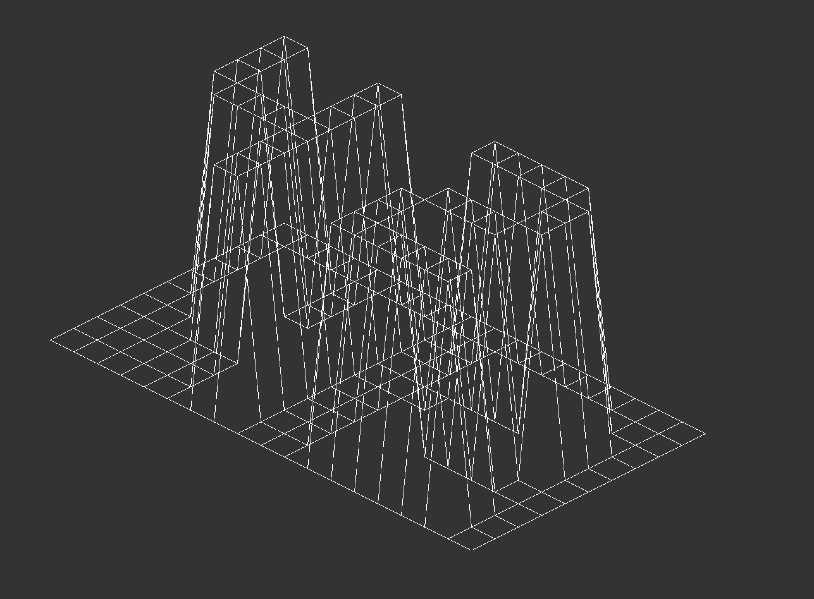
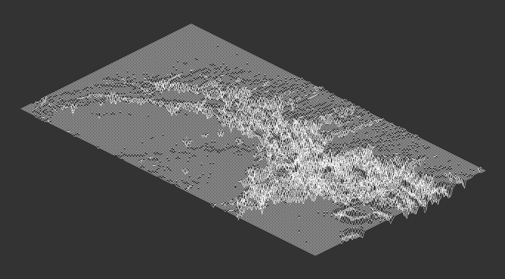

# fdf "Fil de Fer"

[](/LICENSE)

A Norm-compliant C implementation of the FDF wireframe model renderer, parsing 3D height-map data and projecting it into a 2D isometric view.

## Table of Contents

- [About](#about)  
- [Features](#features)  
- [Installation](#installation)  
- [Usage](#usage)  
- [Example](#example)  

`fdf` or " fil de fer" which means Wireframe in French, reads a file containing a grid of height values (the “.fdf” format) and renders it as a 3D wireframe in an isometric projection.
It leverages Bresenham’s line algorithm for efficient line drawing and uses the MinilibX library for window management and pixel plotting.
Built under the 42 School curriculum, this project reinforces your understanding of graphics algorithms, coordinate transformations programming in C.

## Features
- Isometric projection: Converts 3D coordinates to a 2D isometric view.
- Bresenham’s line algorithm: Fast, integer-based line drawing between points.
- Interactive controls:
- Rotate, zoom, and translate the model in real time.
- Reset view or exit cleanly.
- Color gradient: Height-based coloring for visual depth cues.
- Norm-compliant
  - Only permitted functions (malloc, free, open, read, close, math ops).
  - 25 lines max per function.
  - 80-column width limit.
  - 4 functions per file max.
  - Max 4 parameters per function.
 
## Installation

Running `make` will donload the MLX42_codam graphical library, for more information go to their website https://github.com/codam-coding-college/MLX42.
The Makefile is designeed for MAC/Linux users, Windows users will need WSL2 ssubsystem on their machine check out the codam git page for more information.

```bash
make         # build fdf
make clean   # delete object files
make fclean  # delete objects + executables
make re      # rebuild from scratch
```

## Usage

After compiling run **./fdf <test_file.fdf>** you can use the test_maps folder.
```bash
./fdf ./test_maps/42.fdf
```

##Example





